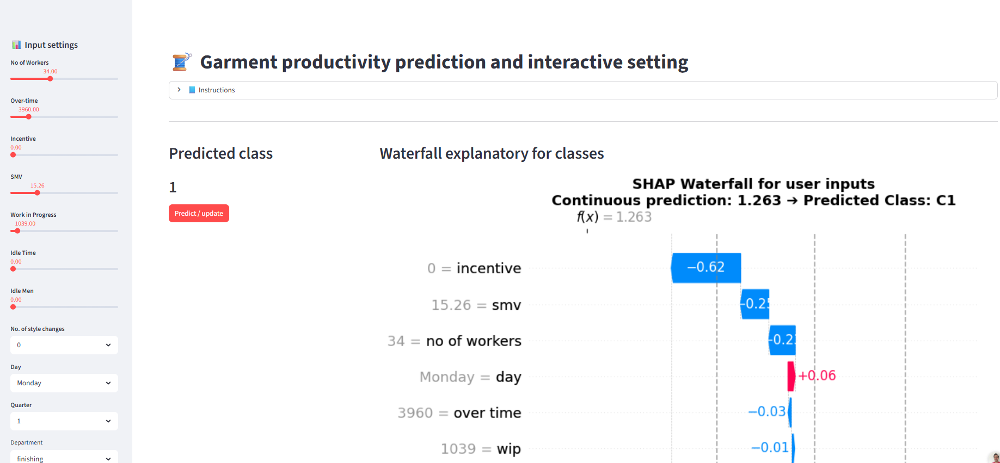

# Hi, I'm Gabriel 👋

## Data Scientist and Optimization Specialist | PhD Mathematics | ML · Statistical Modeling · Python · SQL

Data Scientist with PhD in Mathematics, specializing in predictive modeling and ML-driven insights. 
I build models that not only predict accurately but explain *why* — combining statistical rigor with interpretability and real-world impact.

**Stack:** Python (Pandas, NumPy, Scikit-learn, XGBoost), SQL, Docker, Streamlit. 
**Experience:** Churn prediction, feature engineering, SHAP-based model explainability.

**Currently exploring:** A/B testing at scale, advanced hyperparameter tuning, and operationalizing ML pipelines.

---
## 🛠️ Technical Stack

* **Languages & Tools:** Python (Pandas, NumPy, Scikit-learn), SQL, Docker, Streamlit, LaTeX.
* **Machine Learning:** Predictive Modeling, XAI, and Model Validation.
* **Mathematics:** Optimization, Numerical Analysis, Statistical Modeling, Linear Algebra.
* **Academic:** Numerical Analysis, Statistical Modeling, Algebra & Geometry.
---

## 🚀 Featured Projects

### 1.[Telco Customer Churn Prediction & ROI Simulation](https://github.com/gabarosky/Telcochurn)
Can we predict which telecom customers will churn before they leave, 
and which interventions would actually retain them?

**Business impact:** Preventing 145 customer defections (conservative estimate) 
in a neutral scenario yields net benefit of $32,977 and ROI of 0.62.

<!--- **Model interpretability:** SHAP values explain the top 5 drivers of churn 
per customer segment — actionable for retention teams.-->
### Model Tracking & Reproducibility
- **MLflow tracking**: All experiments logged with metrics (AUC, Recall, Precision), 
  hyperparameters, and model artifacts.
<!--- - **SHAP analysis**: Feature importance plots and force plots for model explainability.-->
<!--- **Deployed:** Docker container ready for inference pipeline.-->
* **Result:** Projected a net profit of $32,977 with a 0.62 ROI by simulating targeted retention campaigns.
*	**Skills:** Machine Learning, Lift Analysis, ROI Simulation, Customer Lifetime Value (CLV), Feature Engineering.
	
### 2.[Predictive Analytics and Smart Insights for Garment Production](https://github.com/gabarosky/productivity_garmet_industry)
**Problem**
Garment manufacturing productivity heavily fluctuates across teams and operational conditions. Can we accurately forecast productivity categories and isolate the true drivers behind low performance? What targeted interventions actually move the needle for operations?

  

🚀 **[Try the interactive app here](https://performancetuner.streamlit.app/)**

**Impact**  
By framing productivity prediction as an ordinal regression problem with optimized thresholds, the model provides actionable levers for operations teams (incentive structures, team sizing, overtime control). Achieving a **1.42x lift over baseline**, the solution enables data-driven simulation of line productivity before shifts begin.

**Core Innovation & Explainability**
* **Ordinal Classification via Regressor:** Trained a `RandomForestRegressor` with threshold optimization (Quadratic Weighted Kappa) to preserve order across productivity tiers.
* **SHAP Waterfall Diagnostics:** Delivers per-prediction local explanations, mapping exact feature contributions for any shift scenario.
* **Prescriptive "What-If" Simulation:** Built an interactive dashboard where decision-makers can adjust operational inputs in real time to simulate target outputs.

**Key Metrics & Results**
* **Model Accuracy:** MAE: `0.4792` | F1-Score (Macro): `0.6113` | Balanced Accuracy: `0.6250` *(Random Forest)*
* **Business Lift:** **1.35x** precision improvement compared to baseline traditional strategy.
* **Production Deployment:** Containerized Streamlit app served via Docker and Streamlit Cloud with persistent prediction logging.

**Tech Stack**  
`Python` · `scikit-learn` · `Random Forest` · `SHAP` · `Streamlit` · `Docker` · `pandas` · `NumPy`	

---

<!--
**gabarosky/gabarosky** is a ✨ _special_ ✨ repository because its `README.md` (this file) appears on your GitHub profile.

Here are some ideas to get you started:

- 🔭 I’m currently working on ...
- 🌱 I’m currently learning ...
- 👯 I’m looking to collaborate on ...
- 🤔 I’m looking for help with ...
- 💬 Ask me about ...
- 📫 How to reach me: ...
- 😄 Pronouns: ...
- ⚡ Fun fact: ...
-->
